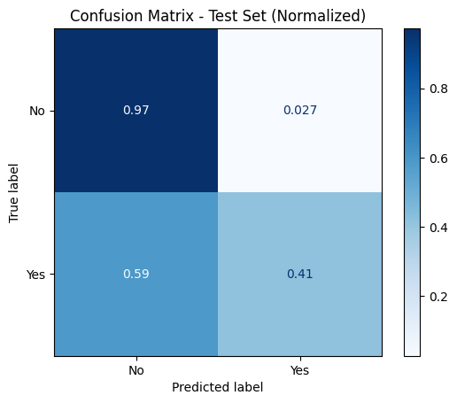

# Logistic Regression: Banking Marketing Campaign

A data science project analyzing a banking marketing campaign dataset to predict customer subscription to term deposits using logistic regression.

## Project Overview

This project demonstrates the complete machine learning workflow for a binary classification problem:
- Data acquisition and preprocessing
- Feature encoding for categorical variables
- Baseline model comparison
- Hyperparameter optimization
- Model evaluation and interpretation

**Business Context**: Help a bank optimize their marketing campaigns by predicting which customers are most likely to subscribe to a term deposit.

## Getting Started

### Prerequisites
- GitHub account
- Basic understanding of Python and machine learning concepts

### Setup Instructions

1. **Fork this repository**
   - Click the "Fork" button in the top-right corner of this repository
   - This creates your own copy of the project

2. **Start a GitHub Codespace**
   - Go to your forked repository
   - Click the green "Code" button
   - Select "Codespaces" tab
   - Click "Create codespace on main"
   - Wait for the environment to load (this may take a few minutes)

3. **Navigate to the notebooks**
   - Open the `notebooks/` directory
   - Choose between:
     - `mvp.ipynb` - Template for students to complete
     - `solution.ipynb` - Complete reference solution

## Project Structure

```
├── notebooks/
│   ├── mvp.ipynb        # Student template (incomplete)
│   └── solution.ipynb   # Complete reference solution
├── data/
│   └── raw/             # Raw data files (auto-generated)
├── models/              # Saved trained models
├── assets/              # Generated plots and visualizations
└── README.md            # This file
```

## Notebooks

### MVP Notebook (`notebooks/mvp.ipynb`)
- **Purpose**: Template for students to complete as part of their assignment
- **Status**: Incomplete - contains structure and comments but missing implementation
- **Use Case**: Students should fork the repository and complete this notebook

### Solution Notebook (`notebooks/solution.ipynb`)
- **Purpose**: Complete reference implementation
- **Status**: Fully implemented with detailed explanations
- **Use Case**: Reference for instructors and students who need guidance

The solution notebook produces visualizations like this confusion matrix showing model performance:



*This normalized confusion matrix reveals how well the final optimized model performs for each class, showing the trade-offs between correctly identifying subscribers vs. non-subscribers.*

## Learning Objectives

By completing this project, students will learn:

1. **Data Preprocessing**
   - Train-test splitting
   - Categorical variable encoding
   - Data type conversion

2. **Model Development**
   - Implementing baseline models (random, majority class)
   - Training logistic regression classifiers
   - Hyperparameter tuning with GridSearchCV

3. **Model Evaluation**
   - Accuracy metrics
   - Confusion matrix analysis
   - Performance comparison visualization

4. **Best Practices**
   - Cross-validation for robust evaluation
   - Model persistence with pickle
   - Reproducible data science workflows

## Dataset

**Source**: Banking Marketing Campaign Dataset
- **Samples**: ~41,000 customer records
- **Features**: Demographics, contact info, campaign details, economic indicators
- **Target**: Binary classification (subscribe: yes/no)
- **Challenge**: Imbalanced dataset with majority "no" responses

## Technologies Used

- **Python 3.x**
- **pandas** - Data manipulation and analysis
- **scikit-learn** - Machine learning algorithms and tools
- **matplotlib** - Data visualization
- **pathlib** - File system operations
- **pickle** - Model serialization

## Contributing

This is an educational project. If you find issues or have suggestions:
1. Create an issue describing the problem
2. Fork the repository and make improvements
3. Submit a pull request with your changes

